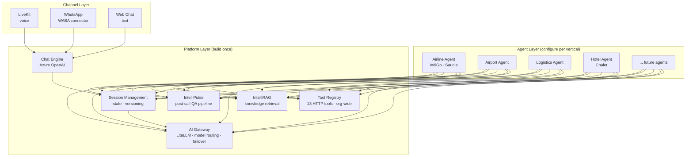

# UniWeave Product Vision

Engineering-facing vision document. Read this to understand what we're building and how it fits together.

Last updated: 2026-03-06

---

## The one-liner

UniWeave is a platform that produces vertical AI agents. The platform ships once. The agents multiply.

---

## Platform vs Agent — the split

Everything we build falls into one of two categories:

| Platform (build once, shared) | Agent (configure per vertical/customer) |
|---|---|
| Tool registry (HTTP tools, org-wide) | System prompt + personality + guardrails |
| Chat Engine (Azure OpenAI, text channel) | Tool selection + wiring from registry |
| IntelliRAG engine (knowledge retrieval) | RAG knowledge base content |
| IntelliPulse pipeline (post-call QA) | Voice/language/creativity settings |
| AI Gateway (model routing + failover) | Call stages (multi-phase flow config) |
| Session management | Domain eval criteria (Pulse rubric) |
| Channel connectors (LiveKit, WhatsApp) | Customer system integrations (Navitaire, Amadeus, Simplotel) |
| Agent versioning + environment management | Intent taxonomy per vertical |

**Operating consequence**: Platform work = engineering tickets with code review, CI, deploy pipelines. Agent work = prompt engineering + tool creation in the UI + KB loading + customer implementation + config. An engineer builds the platform. A product person (with AI tools) builds an agent.

---

## Fundamentals for 1 = fundamentals for 10

Five platform fundamentals that every agent gets for free:

1. **Tool registry** — Platform-level, defined once, attached to any agent. 13 tools today. Each tool = HTTP API call (method, endpoint, headers, params, timeout, retries). Built-in tester. Non-engineers can create tools through the UI.

2. **IntelliRAG** — Knowledge base as a native tool. Every agent ships with RAG by default. Load customer-specific content (FAQs, product docs, policies), index it, attach it. The agent just knows things.

3. **IntelliPulse** — Post-call QA pipeline runs on every interaction automatically. 100% coverage. Produces agent scores, sentiment, NPS, promise tracking, intent classification. No per-agent setup needed.

4. **Multimodal channels** — LiveKit (voice) + Chat Engine (text) + WhatsApp. One agent config, all channels. The agent doesn't know or care which channel the customer is using.

5. **AI Gateway** — Model routing, failover, cost control. LiteLLM proxy shared across all agents. Fast-model for mundane tasks, large-model for reasoning. One gateway, every agent benefits.

The first agent is expensive because we're building fundamentals. The second agent is cheap because we're only writing prompts, creating tools, and loading a knowledge base.

---

## What an agent actually is

An "agent" is not just a system prompt in a UI. It's a complete vertical package:

- **Prompt engineering** — System prompt, call stages, personality, guardrails. The 9-section prompt structure defines how the agent thinks and speaks.
- **Tool creation** — HTTP tools defined in the registry, tested with the built-in tester, wired to the agent's Workflow tab. Each tool = one API call the agent can make.
- **Knowledge base** — RAG content loaded, indexed, attached as a native tool. The agent retrieves answers from customer-specific knowledge without explicit tool calls.
- **Implementation** — Customer system integrations. Navitaire for IndiGo, Amadeus for Saudia, Simplotel for Chalet. This is the hard work per customer.
- **Config** — Model selection (STT/LLM/TTS), voice picker (111 voices), language, creativity level. All UI-configurable.
- **Eval criteria** — Pulse rubric + intent taxonomy per vertical. How we measure whether this agent is doing its job.

---

## The three modules

### IntelliRAG — Knowledge as native tool

Every agent ships with RAG. Customers load their knowledge base (FAQs, policies, product info), IntelliRAG indexes it, and the agent can retrieve answers in real time. No explicit "search the knowledge base" step — it's a native tool the agent invokes automatically when it needs information.

### IntelliPulse — QA on every interaction

Automated post-interaction quality assurance. Pipeline: Capture (100% of interactions) → Transcribe → AI QA (configurable rubric) → Score & Report. Produces: agent scores (x/100), sentiment (x/100), pseudo NPS (x/10), promise tracking, intent classification. Has its own 3-tab dashboard.

### Chat Module — Agents become multimodal

Voice agents become text agents. Same agent config, new channel. Architecture: Azure OpenAI (not Ultravox — text doesn't need speech-to-speech) → channel-agnostic Chat API → WhatsApp connector. Four layers: Chat Engine → WhatsApp WABA → tool integrations → KB + handoff.

---

## What the customer buys

| Package | Includes | Example |
|---|---|---|
| **Voice AI Agent** (primary) | Named vertical agent + platform + IntelliRAG + voice channel | Saudia Airline Agent |
| **+ Multimodal** (add-on) | Chat + WhatsApp channels for the same agent | Same agent on WhatsApp |
| **+ Pulse** (bundled or standalone) | 100% interaction QA + analytics dashboard | Every interaction scored |

Outcome-based pricing applies to the agent, not the platform. Customers pay per successful containment — not per minute, token, or seat.

---

## April 23 — what ships

Internal gate: April 9. Public launch: April 23.

- [ ] Airline Agent live — IndiGo + Saudia
- [ ] Airport Agent integration-ready
- [ ] Logistics Agent integration-ready
- [ ] Chat Engine operational
- [ ] WhatsApp connector operational (1+ customer)
- [ ] IntelliRAG attached as default tool
- [ ] IntelliPulse pipeline running on all interactions
- [ ] AI Gateway routing production traffic
- [ ] CRM connectors: Salesforce, Dynamics 365
- [ ] CCaaS connectors: Genesys, C-Zentrix (at least 2 live)

60% is already live (Saudia + IndiGo deployments). Net new build = chat/session management, IntelliRAG config UI, Pulse integration, AI Gateway deploy.

---

## Architecture

Each agent is a configuration bundle that uses platform services. Channels route through the Chat Engine (text) or LiveKit (voice) into session management. The AI Gateway handles model selection. Tools, RAG, and Pulse are shared infrastructure.
