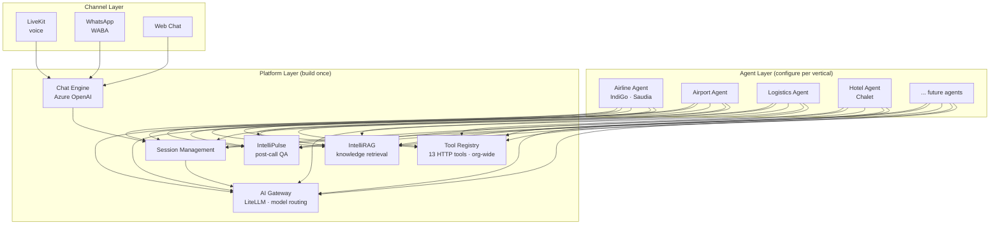

# UniWeave

**Real-time conversational execution platform for enterprise voice agents.**

The platform ships once. The agents multiply.

We own orchestration, tool execution, latency optimization, and reliability — powering AI agents that handle millions of customer interactions across airlines, hotels, and enterprise CX.

---

## Architecture

---

## Current sprint snapshot

**Last updated**: March 8, 2026 (session 32 deep sync)

> **Phase shift**: Individual features are built or near-complete. The next major milestone is **integration + first unified Azure deployment** — merging all work, fixing production gaps, deploying as one platform, and setting up CI/CD.

### In Progress

| What | Owner | Due | Progress | Notes |
|---|---|---|---|---|
| Chat Engine (#94) | Nomaan | Mar 14 | **8/12** | Major progress — confirm remaining 4 items |
| IntelliPulse post-call webhook (#96) | Upender | Mar 10 | **4/8** | Mode B (audio URL) built + tested locally. **Blocked on #122 (still in RTB — see escalation below).** |
| IntelliRAG backend (#98) | Himanshu | Mar 10 | **11/11 ✅** | All done — pending Himanshu review to move to Done. |
| Unified auth/SSO (#120) | Himanshu + Upender | Mar 12 | 0/5 | Waiting on Pramod (external) for global DB |
| UniScript (#118) | Agam | — | **10/10 features built** | 155 tests passing. Portal testing. F11 (tool support) spec done, dev starting. |

### Next Phase: Integration + Deployment

All features above have been built individually. What's next:

1. **Merge all feature work** into a deployable state across repos
2. **Fix 3 Critical Helm gaps** before deploying (see below)
3. **Fresh Azure deployment** — first time deploying the full integrated platform
4. **Set up CI/CD** — automated build, test, deploy pipeline for all future changes

### Ready to Build

| What | Owner | Due | Blocker |
|---|---|---|---|
| Java routing fixes (#122) | Upender + Harsh | Mar 10 | **⚠️ STILL IN READY TO BUILD — must move to In Progress today. Blocks #96 end-to-end. Deadline tomorrow.** |
| WABA provisioning (#108) | Ravinder | Mar 10 | **⚠️ Deadline tomorrow. No Trello member assigned. Coordinating off-board. Blocks #95 + #113.** |
| PRISM Hotels (#113) | **TBD — unassigned** | Mar 10 | **⚠️ Deadline tomorrow. No owner assigned.** Depends on #94 + #95 + #108. |
| Pulse enrichment (#97) | **TBD — unassigned** | Mar 14 | Blocked by #96. Unassigned. |
| WhatsApp connector (#95) | Nomaan | Mar 19 | WABA not provisioned (#108) |
| IntelliRAG config UI (#99) | **TBD — unassigned** | — | Needs #98 review + Agam wireframes |
| Arabic greeting bug (#104) | **TBD — unassigned** | — | Persistent. Unassigned. |

### Critical Production Gaps (must fix before integration deploy)

Surfaced from 13-repo architecture deep-dive. **Escalate to Harsh immediately.**

1. **TOOL_BASE_URL broken in Helm** — livekit-agent config sets `TOOL_BASE_URL: "https://"`. All HTTP tool calls fail silently in prod.
2. **Helm secrets in plaintext** — API keys, passwords, tokens in `values.yaml` committed to repo.
3. **MongoDB DB mismatch** — audit-publisher writes to `audit-analytics`, audit-listener reads from `audit-analytics-uniweave`. Post-call data silently dropped.

### Key Decisions

- **MCP = universal tool interface** (Arjun directive). Every new capability = MCP server first.
- **Chat module uses Azure OpenAI** (not Ultravox). Channel-agnostic Chat API.
- **UniWeave is master for auth/RBAC** — all services inherit orgs + users + roles.
- **April 23 launch**: 60% already live (Saudia + IndiGo). Net new = Chat Engine, IntelliRAG UI, Pulse integration.

---

## Engineering notes

- **IntelliPulse integration**: Mode B (audio URL to Pulse) built + tested locally — cron every 10 min + manual trigger endpoints. Mode A (transcript passthrough) + call-end event trigger still pending. **#122 (Java routing) is STILL IN READY TO BUILD as of Mar 8 deep sync — both #96 and #122 due tomorrow (Mar 10). #122 must move to In Progress today.**
- **UniScript**: 10/10 features built. FastAPI + PostgreSQL + Redis. AI Gateway integrated. MCP server (10 tools, dual transport). 155 tests passing. Portal built + testing. F11 (tool support) spec done, dev starting. **Repo: [uniscript](https://github.com/AIONOS-UNIWEAVE-PLATFORM/uniscript)** (renamed from voice-prompt-builder).
- **IntelliRAG**: Exposed as MCP server — agents consume via MCP, same as any other tool. 11/11 checklist complete — v0.1 built by Himanshu. Pending review to move to Done. Auth (#120) blocked on Pramod (external).

## Upcoming

- **CX Ops floor session** — March 9 (tomorrow). Required for roadmap finalization.
- **Immediate actions**: (1) Escalate #122 to Harsh + Upender — must move to In Progress today. (2) Escalate 3 Helm gaps to Harsh — still not communicated. (3) Coordinate Ravinder on WABA (#108, due tomorrow). (4) Move #98 to Done after Himanshu confirms deployable. (5) Confirm #94 remaining 4 items with Nomaan. (6) Follow Pramod on global DB for #120. (7) Assign owner for #97/#113/#104.

---

## Repos

| Repo | What it does | Status |
|---|---|---|
| [ai-gateway](https://github.com/AIONOS-UNIWEAVE-PLATFORM/ai-gateway) | LiteLLM proxy — model routing, failover, cost control | **Deployed** (`gateway.uniweave.com`) |
| [uniscript](https://github.com/AIONOS-UNIWEAVE-PLATFORM/uniscript) | UniScript — voice AI prompt engineering service | **10/10 features built** (155 tests). Tool support (F11) in build. |
| More repos transferring soon | Core platform, analytics, user management | Pending engineer onboarding |

---

## Docs

- **[System Architecture](https://github.com/AIONOS-UNIWEAVE-PLATFORM/.github/blob/main/docs/system-architecture.md)** — Full platform — all 13 repos, data flows, deployment topology
- **[Product Vision](https://github.com/AIONOS-UNIWEAVE-PLATFORM/.github/blob/main/docs/VISION.md)** — What we're building and how it fits together
- **[Roadmap](https://github.com/AIONOS-UNIWEAVE-PLATFORM/.github/blob/main/docs/ROADMAP.md)** — Two-layer capability roadmap + April 23 milestone
- **[Team Guidelines](https://github.com/AIONOS-UNIWEAVE-PLATFORM/.github/blob/main/TEAM_GUIDELINES.md)** — Development conventions and onboarding
- **[CLAUDE.md Template](https://github.com/AIONOS-UNIWEAVE-PLATFORM/.github/blob/main/CLAUDE_MD_TEMPLATE.md)** — Standard CLAUDE.md for new repos
