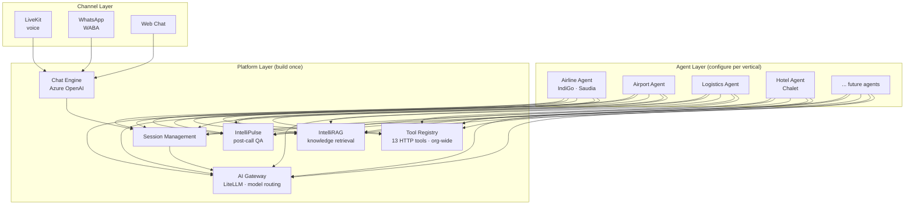

# UniWeave

**Real-time conversational execution platform for enterprise voice agents.**

The platform ships once. The agents multiply.

We own orchestration, tool execution, latency optimization, and reliability — powering AI agents that handle millions of customer interactions across airlines, hotels, and enterprise CX.

---

## Architecture

---

## Current sprint snapshot

**Last updated**: March 6, 2026

| What | Status | Owner | Target |
|---|---|---|---|
| Chat Engine (#94) | In Progress (0?/12) | Nomaan | Mar 14 |
| IntelliPulse post-call webhook (#96) | In Progress | Upender | Mar 10 |
| IntelliRAG backend (#98) | In Progress (3/11) | Himanshu | Mar 10 |
| WABA provisioning (#108) | Ready to Build | Ravinder | Mar 9 |
| Unified auth/SSO (#120) | In Progress | Himanshu + Upender | TBD |
| AI Gateway (#112) | **Done** | Agam | Mar 6 |
| UniScript (#118) | In Progress | Agam | Mar 11 |

**Key decision**: UniWeave is the master for auth and RBAC. All services (IntelliRAG, IntelliPulse, future modules) inherit via a global auth table. No service maintains its own user management.

**April 23 launch**: 60% already live (Saudia + IndiGo). Net new = Chat Engine, IntelliRAG config UI, Pulse integration, AI Gateway deploy.

---

## Repos

| Repo | What it does | Status |
|---|---|---|
| [ai-gateway](https://github.com/AIONOS-UNIWEAVE-PLATFORM/ai-gateway) | LiteLLM proxy — model routing, failover, cost control | Deployed (`gateway.uniweave.com`) |
| [voice-prompt-builder](https://github.com/AIONOS-UNIWEAVE-PLATFORM/voice-prompt-builder) | UniScript — interactive voice agent prompt builder | In Progress |
| More repos transferring soon | Core platform, analytics, user management | Pending engineer onboarding |

---

## Docs

- **[Product Vision](https://github.com/AIONOS-UNIWEAVE-PLATFORM/.github/blob/main/docs/VISION.md)** — What we're building and how it fits together
- **[Roadmap](https://github.com/AIONOS-UNIWEAVE-PLATFORM/.github/blob/main/docs/ROADMAP.md)** — Two-layer capability roadmap + April 23 milestone
- **[Team Guidelines](https://github.com/AIONOS-UNIWEAVE-PLATFORM/.github/blob/main/TEAM_GUIDELINES.md)** — Development conventions and onboarding
- **[CLAUDE.md Template](https://github.com/AIONOS-UNIWEAVE-PLATFORM/.github/blob/main/CLAUDE_MD_TEMPLATE.md)** — Standard CLAUDE.md for new repos
