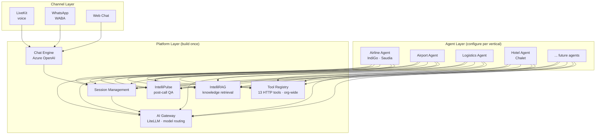

# UniWeave

**Real-time conversational execution platform for enterprise voice agents.**

The platform ships once. The agents multiply.

We own orchestration, tool execution, latency optimization, and reliability — powering AI agents that handle millions of customer interactions across airlines, hotels, and enterprise CX.

---

## Architecture

---

## Current sprint snapshot

**Last updated**: March 7, 2026

### In Progress

| What | Owner | Due | Progress | Notes |
|---|---|---|---|---|
| Chat Engine (#94) | Nomaan | Mar 14 | **8/12** | Major progress — confirm remaining 4 items Monday |
| IntelliPulse post-call webhook (#96) | Upender | Mar 10 | Functionally complete | Cron-based approach built + tested locally. Blocked on Java routing (#122). **Monday: demo + review.** |
| IntelliRAG backend (#98) | Himanshu | Mar 10 | **11/11** | Checklist complete. v0.1 built. Review Monday — likely ready for Done. |
| Unified auth/SSO (#120) | Himanshu + Upender | Mar 12 | 0/5 | Waiting on Pramod (IntelliRAG engineer) for global DB implementation |
| UniScript (#118) | Agam | — | **9/10 features done** | 149 tests passing. Complete: one-shot generation, chat/refinement, packs, assembler, auth, credits, AI Gateway, telemetry, MCP server. **Remaining: Portal (admin+dev views, templates CRUD).** |

### Ready to Build

| What | Owner | Due | Blocker |
|---|---|---|---|
| WhatsApp connector (#95) | Nomaan | Mar 19 | WABA not provisioned (#108) |
| Pulse enrichment (#97) | **TBD** | Mar 14 | Blocked by #96 |
| IntelliRAG config UI (#99) | **TBD** | — | Needs #98 review + wireframes |
| Arabic greeting bug (#104) | **TBD** | — | Unassigned |
| WABA provisioning (#108) | Ravinder | Mar 10 | Coordinating — not on Trello |
| PRISM Hotels (#113) | **TBD** | Mar 10 | Depends on #94 + #95 + #108 |
| Java routing fixes (#122) | Upender + Himanshu | Mar 10 | Blocks #96 |

### Critical Production Gaps

Surfaced from 13-repo architecture deep-dive. **Escalate to Harsh Monday.**

1. **TOOL_BASE_URL broken in Helm** — livekit-agent config sets `TOOL_BASE_URL: "https://"`. All HTTP tool calls fail silently in prod.
2. **Helm secrets in plaintext** — API keys, passwords, tokens in `values.yaml` committed to repo.
3. **MongoDB DB mismatch** — audit-publisher writes to `audit-analytics`, audit-listener reads from `audit-analytics-uniweave`. Post-call data silently dropped.

### Key Decisions

- **MCP = universal tool interface** (Arjun directive). Every new capability = MCP server first.
- **Chat module uses Azure OpenAI** (not Ultravox). Channel-agnostic Chat API.
- **UniWeave is master for auth/RBAC** — all services inherit orgs + users + roles.
- **April 23 launch**: 60% already live (Saudia + IndiGo). Net new = Chat Engine, IntelliRAG UI, Pulse integration.

---

## Repos

| Repo | What it does | Status |
|---|---|---|
| [ai-gateway](https://github.com/AIONOS-UNIWEAVE-PLATFORM/ai-gateway) | LiteLLM proxy — model routing, failover, cost control | **Deployed** (`gateway.uniweave.com`) |
| [voice-prompt-builder](https://github.com/AIONOS-UNIWEAVE-PLATFORM/voice-prompt-builder) | UniScript — voice AI prompt engineering service | **9/10 features done** (149 tests) |
| More repos transferring soon | Core platform, analytics, user management | Pending engineer onboarding |

---

## Docs

- **[Engineering Status](https://github.com/AIONOS-UNIWEAVE-PLATFORM/.github/blob/main/docs/STATUS.md)** — Detailed status with architecture notes and Monday actions
- **[System Architecture](https://github.com/AIONOS-UNIWEAVE-PLATFORM/.github/blob/main/docs/system-architecture.md)** — Full platform — all 13 repos, data flows, deployment topology
- **[Product Vision](https://github.com/AIONOS-UNIWEAVE-PLATFORM/.github/blob/main/docs/VISION.md)** — What we're building and how it fits together
- **[Roadmap](https://github.com/AIONOS-UNIWEAVE-PLATFORM/.github/blob/main/docs/ROADMAP.md)** — Two-layer capability roadmap + April 23 milestone
- **[Team Guidelines](https://github.com/AIONOS-UNIWEAVE-PLATFORM/.github/blob/main/TEAM_GUIDELINES.md)** — Development conventions and onboarding
- **[CLAUDE.md Template](https://github.com/AIONOS-UNIWEAVE-PLATFORM/.github/blob/main/CLAUDE_MD_TEMPLATE.md)** — Standard CLAUDE.md for new repos
